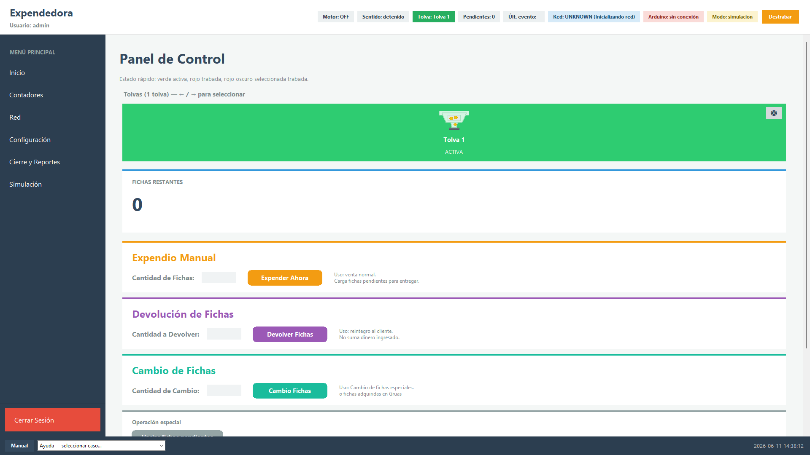
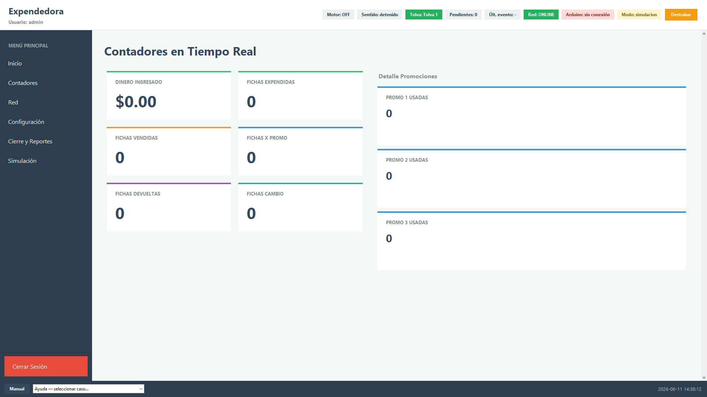
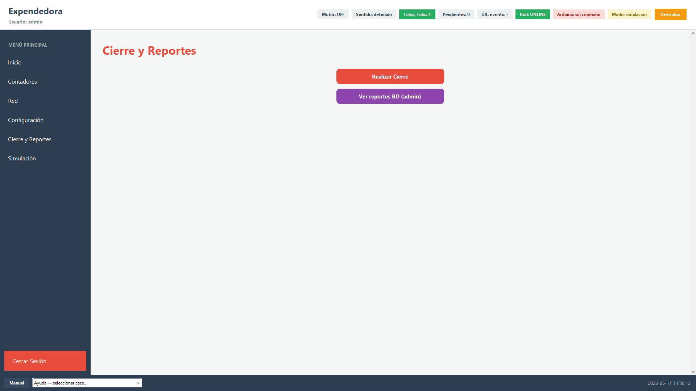

# Manual de usuario — Expendedora

Guía para cajeros. Si algo sale mal, usá el menú **Ayuda** abajo a la izquierda.

---

## Pantalla de Inicio

Acá trabajás el día a día.

- **Fichas restantes**: cuántas fichas faltan entregar al cliente.
- **Tolvas** (arriba): cuál máquina está activa. Verde = bien. Rojo = trabada.
- **Flechas ← →** del teclado: cambiar de tolva.

---

## Cómo vender fichas (paso a paso)

1. El cliente te paga.
2. Escribí cuántas fichas vendió en **Cantidad de fichas** (zona amarilla de la captura).
3. Tocá **Expender Ahora** (o la tecla Enter).
4. La máquina empieza a dar las fichas.
5. Mirá **Fichas restantes**: va bajando de a una hasta llegar a **0**.
6. Cuando llega a **0**, la venta terminó.

Si el cliente compró **dos promos iguales**, tocá la tecla de la promo **dos veces**.

---

## Promociones (teclas rápidas)

En vez de escribir la cantidad, podés usar una tecla:

| Promo | Tecla |
|-------|-------|
| Promo 1 | `/` (barra) |
| Promo 2 | `*` (asterisco) o `x` |
| Promo 3 | `-` (menos) |

Cada vez que tocás la tecla, se carga esa promo (precio + fichas). Podés tocarla varias veces seguidas.

---

## Devolución de fichas

Para **devolver** fichas al cliente **sin cobrar** de nuevo.

1. Escribí la cantidad en **Cantidad a devolver** (bloque violeta).
2. Tocá **Devolver Fichas**.

---

## Cambio de fichas

Para fichas de **grúas** u otras máquinas. **No suma plata** en la caja.

1. Escribí la cantidad en **Cantidad de cambio** (bloque verde agua).
2. Tocá **Cambio Fichas**.

---

## Si hay un error en la venta

**Vaciar fichas pendientes** cancela la venta que quedó a medias.

- Devolvé a la tolva las fichas que **ya salieron**.
- Después tocá **Vaciar fichas pendientes** (bloque gris) y confirmá.

---

## Contadores

Menú **Contadores**: plata del día, fichas vendidas, promos usadas, etc.

---

## Cierre del día y salir

- **Cierre y Reportes → Realizar cierre**: cierra la jornada de la máquina (solo cuando corresponda).
- **Cerrar sesión** (botón rojo abajo del menú): el cajero termina su turno. **No** es lo mismo que el cierre del día.

---

## Si la máquina se traba

- Tocá el botón naranja **Destrabar** (arriba).
- O elegí en **Ayuda → ¿Motor trabado?**

Ambos hacen lo mismo: destraban con ficha de prueba (no cuenta en la venta).

---

## Menú Ayuda (barra inferior izquierda)

Además del **Manual**, el botón **Ayuda ▾** tiene estos casos:

| Caso | Qué hace |
|------|----------|
| ¿Las fichas salen pero no se cuentan? | Reconecta el Arduino y ofrece reintentar la venta pendiente. |
| ¿Motor trabado? | Destraba la tolva (ficha de prueba, no suma a la venta). |
| ¿Arduino sin conexión? | Intenta reconectar (igual que tocar «Arduino sin conexión» arriba). |
| ¿Fichas pendientes que no salen? | Reconectar y reintentar, o anular la venta (vaciar buffer). |
| ¿Ventana trabada / sin responder? | Indica cerrar sesión; en **modo kiosco** puede reiniciar la app. |

---

## Luces de estado (arriba)

- **Red ONLINE**: hay internet.
- **Arduino OK**: la máquina habla bien con el dispensador.
- **Arduino sin conexión**: tocá esa palabra para intentar reconectar.

---

## Cerrar sesión

Botón rojo al final del menú de la izquierda. Volvés a la pantalla de login.
